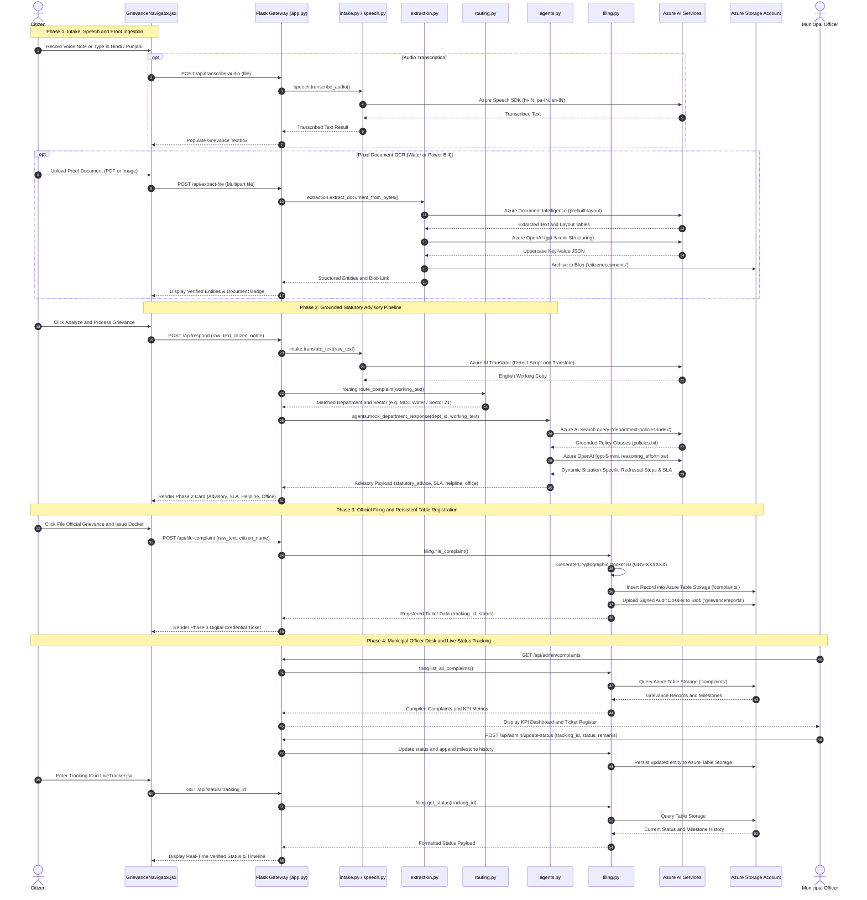

# JanConnect (जन कनेक्ट / ਚੰਡੀਗੜ੍ਹ ਜਨ ਕਨੈਕਟ)
### Multilingual AI Civic Grievance Navigation, Document Intelligence & Policy Resolution Platform

[](https://azure.microsoft.com/en-us/products/ai-services/openai-service/)
[](https://azure.microsoft.com/en-us/products/ai-services/ai-document-intelligence)
[](https://azure.microsoft.com/en-us/products/ai-services/ai-search)
[](https://azure.microsoft.com/en-us/products/ai-services/ai-translator)
[](https://azure.microsoft.com/en-us/products/ai-services/speech-services)
[](https://azure.microsoft.com/en-us/products/storage/)
[](https://vitejs.dev/)
[](https://flask.palletsprojects.com/)

---

## 📖 Project Overview & Executive Summary

**JanConnect (जन कनेक्ट / ਚੰਡੀਗੜ੍ਹ ਜਨ ਕਨੈਕਟ)** is an enterprise-grade, multilingual civic grievance navigation and government policy clarifier system engineered specifically for municipal administration and citizen empowerment.

In municipal administration (such as Municipal Corporation Chandigarh & Power Distribution Limited), citizens face systemic hurdles:
1. **Language & Dialect Barriers**: Citizens describe grievances in Hindi, Punjabi, or Hinglish via voice notes or colloquial text, whereas administrative policy indexes operate in formal English.
2. **Complex Document Layouts**: Disputed municipal utility bills (water bills, electricity bills, e-Sampark receipts) have dense multi-column layouts, tables, and tariff slabs that standard OCR tools fail to structure.
3. **Misrouting & Jurisdictional Confusion**: Grievances are submitted to incorrect divisions (e.g., MCC Public Health vs. CPDL Electricity vs. MOH Sanitation), causing weeks of forwarding delays.
4. **Lack of Policy Awareness & Grounded SLAs**: Citizens are unaware of statutory resolution timelines under the **Right to Service (RTS) Act** and legal redressal channels.
5. **Lack of Transparent Tracking & Officer Workflows**: Once filed, citizens have no visibility into the lifecycle state, assigned junior engineers, or audit remarks.

JanConnect bridges this gap by deploying an autonomous **6-Stage Agentic Pipeline** backed by **Azure AI Foundry**, **Azure Document Intelligence**, **Azure AI Search**, **Azure AI Translator**, **Azure Speech SDK**, and **Azure Table & Blob Storage**.

---

## 🏛️ End-to-End System Architecture & Project Flow

### 🔄 Project Flow & Architecture Graph

```mermaid
flowchart TD
    %% Citizen and Officer Inputs
    subgraph Inputs ["1. Citizen & Municipal Officer Entry Points"]
        VoiceIn["Voice Grievance Recording<br/>(Hindi, Punjabi, English Audio)"]
        TextIn["Regional Grievance Input<br/>(Colloquial, Hinglish, Gurmukhi)"]
        DocIn["Citizen Utility Proof Document<br/>(Water or Power Bill, ID Card)"]
        PolicyIn["Government Policy Circular<br/>(Gazette Notification, Scheme PDF)"]
        OfficerIn["Municipal Officer Action<br/>(SDO, Field Engineer Verification)"]
    end

    %% Frontend Components
    subgraph Frontend ["2. React 18 + Vite Frontend (frontend/src/components/)"]
        GrievanceUI["frontend/src/components/GrievanceNavigator.jsx<br/>- 5-Stage Stepper Ribbon<br/>- Voice Recording & Document OCR Modal<br/>- Grounded Advisory & Docket Filing"]
        TrackerUI["frontend/src/components/LiveTracker.jsx<br/>- Docket Status Query (GRV-XXXXXX)<br/>- Real-Time Milestone History Timeline"]
        PolicyUI["frontend/src/components/PolicyClarifier.jsx<br/>- Welfare Schemes & Circular Ingestion<br/>- Clause Q&A & 7-Language Audio Translation"]
        OfficerUI["frontend/src/components/OfficerDesk.jsx<br/>- Municipal KPI Summary Tiles<br/>- Engineer Assignment & Audit Remarks"]
    end

    %% Backend Flask Gateway
    subgraph Gateway ["3. Flask API Gateway (backend/app.py - Port 5001)"]
        R_Audio["POST /api/transcribe-audio"]
        R_Extract["POST /api/extract-file & /api/extract-text"]
        R_Route["POST /api/route"]
        R_Respond["POST /api/respond"]
        R_File["POST /api/file-complaint"]
        R_Status["GET /api/status/:tracking_id"]
        R_Admin["GET /api/admin/complaints & POST /api/admin/update-status"]
        R_Policy["POST /api/policy/extract, /api/policy/ask, /api/policy/translate"]
    end

    %% Agentic Core Services
    subgraph Pipeline ["4. Agentic Pipeline Services (backend/services/)"]
        S1["Stage 1: backend/services/intake.py & speech.py<br/>- Multilingual Normalization & Audio STT"]
        S2["Stage 2: backend/services/extraction.py<br/>- Layout OCR & Entity Structuring"]
        S3["Stage 3: backend/services/routing.py<br/>- Zero-Latency Lexical & Sector Routing"]
        S4["Stage 4: backend/services/agents.py<br/>- Grounded Specialist Agent & RAG Synthesis"]
        S5["Stage 5: backend/services/filing.py<br/>- Table Storage & Signed Dossier Archival"]
        S6["Stage 6: backend/services/policy_qa.py<br/>- Policy Clarifier & Multilingual Q&A"]
    end

    %% Grounding Data Files
    subgraph GroundingData ["Local Policy Knowledge & Mock Corpus"]
        PolFile["policies.txt<br/>(Grounding Statutory Corpus indexed into Azure)"]
        MockDept["backend/mock_data/department_policies.json<br/>(MCC Water, CPDL, MOH, B&R, RTI Lexicons & SLAs)"]
        MockComplaints["backend/mock_data/complaints_sample.json<br/>(Archival Scenarios & Baseline Data)"]
    end

    %% Azure Cloud Infrastructure
    subgraph Azure ["5. Connected Azure AI Cloud Infrastructure"]
        AzSpeech["Azure Cognitive Speech SDK<br/>- Audio STT (hi-IN, pa-IN, en-IN)"]
        AzTrans["Azure AI Translator API v3.0<br/>- Script Detection & English Working Copy"]
        AzDoc["Azure Document Intelligence<br/>- Model: prebuilt-layout OCR"]
        AzOpenAI["Azure OpenAI Service<br/>- Deployment: gpt-5-mini<br/>- Entity Extraction, Advisory & Policy Q&A"]
        AzSearch["Azure AI Search<br/>- Index: department-policies-index<br/>- Semantic & Keyword Grounding RAG"]
    end

    %% Azure Persistent Storage
    subgraph Storage ["6. Azure Storage Account (janconnectstorage)"]
        AzTables[("Azure Table Storage<br/>Table: 'complaints'<br/>- Live Grievance Entities<br/>- Timestamped Milestone Audit Logs")]
        AzBlobs[("Azure Blob Storage<br/>Containers:<br/>- 'citizendocuments' (Proof Bills/IDs)<br/>- 'grievancereports' (Signed Audit Dossiers)<br/>- 'policydocuments' (Uploaded Circulars)")]
    end

    %% Connections: Inputs to UI
    VoiceIn --> GrievanceUI
    TextIn --> GrievanceUI
    DocIn --> GrievanceUI
    PolicyIn --> PolicyUI
    OfficerIn --> OfficerUI

    %% Connections: UI to Gateway
    GrievanceUI -->|"Audio Blob"| R_Audio
    GrievanceUI -->|"PDF or Image File"| R_Extract
    GrievanceUI -->|"Grievance Text and Name"| R_Respond
    GrievanceUI -->|"Docket Registration"| R_File
    TrackerUI -->|"Lookup Tracking ID"| R_Status
    OfficerUI -->|"List and Transition Status"| R_Admin
    PolicyUI -->|"Circular File and Doubts"| R_Policy

    %% Connections: Gateway to Pipeline Services
    R_Audio --> S1
    R_Extract --> S2
    R_Respond --> S1
    S1 -->|"English Working Text"| S3
    S3 -->|"Assigned Department and Sector"| S4
    R_File --> S5
    R_Status --> S5
    R_Admin --> S5
    R_Policy --> S6

    %% Connections: Pipeline to Local Corpus
    MockDept -.-> S3
    MockDept -.-> S4
    PolFile -.->|"Pre-indexed Corpus"| AzSearch

    %% Connections: Pipeline to Azure Cloud Services
    S1 -->|"Voice Bytes Stream"| AzSpeech
    AzSpeech -->|"Transcribed Text"| S1
    S1 -->|"Regional Text Payload"| AzTrans
    AzTrans -->|"English Translation"| S1

    S2 -->|"Binary File Stream"| AzDoc
    AzDoc -->|"Structured Layout and Tables"| AzOpenAI
    AzOpenAI -->|"JSON Key-Value Entities"| S2
    S2 -->|"Upload Proof Bill"| AzBlobs

    S4 -->|"Search Query: Text and Department"| AzSearch
    AzSearch -->|"Retrieved Policy Clauses"| S4
    S4 -->|"Grounding Context and Problem"| AzOpenAI
    AzOpenAI -->|"Dynamic Advisory and RTS SLA"| S4

    S5 -->|"Issue Tracking ID: GRV-XXXXXX"| AzTables
    S5 -->|"JSON Audit Dossier"| AzBlobs

    S6 -->|"Circular Stream"| AzDoc
    S6 -->|"Archive Circular"| AzBlobs
    S6 -->|"Policy Text and Question"| AzOpenAI
    AzOpenAI -->|"Grounded Answer and Citations"| S6
    S6 -->|"Target Language Text"| AzTrans

    %% Feedback to Frontend UI
    S4 -.->|"Phase 2 Grounded Statutory Advisory"| GrievanceUI
    S5 -.->|"Phase 3 Digital Credential Ticket"| GrievanceUI
    AzTables -.->|"Milestone Status Timeline"| TrackerUI
    AzTables -.->|"Aggregated Metrics and Complaints"| OfficerUI
    S6 -.->|"Grounded Answer and Audio"| PolicyUI

    %% Color & Style Classes
    classDef inputStyle fill:#f8fafc,stroke:#64748b,stroke-width:1.5px,color:#0f172a;
    classDef uiStyle fill:#eff6ff,stroke:#2563eb,stroke-width:2px,color:#1e3a8a;
    classDef gwStyle fill:#fef3c7,stroke:#d97706,stroke-width:2px,color:#78350f;
    classDef pipeStyle fill:#f0fdf4,stroke:#16a34a,stroke-width:2px,color:#14532d;
    classDef azStyle fill:#e0f2fe,stroke:#0284c7,stroke-width:2px,color:#0369a1;
    classDef storeStyle fill:#f5f3ff,stroke:#7c3aed,stroke-width:2px,color:#4c1d95;
    classDef dataStyle fill:#fff7ed,stroke:#ea580c,stroke-width:1.5px,color:#9a3412;

    class VoiceIn,TextIn,DocIn,PolicyIn,OfficerIn inputStyle;
    class GrievanceUI,TrackerUI,PolicyUI,OfficerUI uiStyle;
    class R_Audio,R_Extract,R_Route,R_Respond,R_File,R_Status,R_Admin,R_Policy gwStyle;
    class S1,S2,S3,S4,S5,S6 pipeStyle;
    class PolFile,MockDept,MockComplaints dataStyle;
    class AzSpeech,AzTrans,AzDoc,AzOpenAI,AzSearch azStyle;
    class AzTables,AzBlobs storeStyle;
```



---

### ⚡ Chronological Execution Flow (Call Sequence Diagram)



---

### 🔗 Codebase File & Connection Matrix

| User Action / Trigger | Frontend Source File | Backend API Endpoint (`backend/app.py`) | Backend Service File (`backend/services/`) | Connected Azure Cloud Services | Data Destination / Persistence |
|---|---|---|---|---|---|
| **Voice Grievance Recording** | `frontend/src/components/GrievanceNavigator.jsx` | `POST /api/transcribe-audio` | `backend/services/speech.py` | **Azure Cognitive Speech SDK** (`hi-IN`, `pa-IN`, `en-IN`) | Transcribed text in React state |
| **Multilingual Grievance Intake** | `frontend/src/components/GrievanceNavigator.jsx` | `POST /api/respond` | `backend/services/intake.py` | **Azure AI Translator** (auto-detect Hindi/Punjabi/English) | English working copy for downstream agents |
| **Proof Document Upload (Bill/ID)** | `frontend/src/components/GrievanceNavigator.jsx` | `POST /api/extract-file` | `backend/services/extraction.py` | **Azure Document Intelligence** (`prebuilt-layout`) + **Azure OpenAI** (`gpt-5-mini`) | Extracted JSON entities + **Azure Blob Storage** (`citizendocuments`) |
| **Department & Sector Routing** | `frontend/src/components/GrievanceNavigator.jsx` | `POST /api/route` | `backend/services/routing.py` | Local Lexical Classifier + Sector Regex Engine | Assigned municipal department & helpline |
| **Grounded Advisory Generation** | `frontend/src/components/GrievanceNavigator.jsx` | `POST /api/respond` | `backend/services/agents.py` | **Azure AI Search** (`department-policies-index`) + **Azure OpenAI** (`gpt-5-mini`) | Dynamic statutory advisory & SLA rules |
| **Official Docket Registration** | `frontend/src/components/GrievanceNavigator.jsx` | `POST /api/file-complaint` | `backend/services/filing.py` | **Azure Table Storage** (`complaints`) + **Azure Blob Storage** (`grievancereports`) | Tracking ID (`GRV-XXXXXX`), Table entity, Signed Audit Dossier |
| **Real-Time Lifecycle Tracking** | `frontend/src/components/LiveTracker.jsx` | `GET /api/status/:tracking_id` | `backend/services/filing.py` | **Azure Table Storage** (`complaints`) | Live milestone timeline & inspector notes |
| **Officer Dispatch & Remarks** | `frontend/src/components/OfficerDesk.jsx` | `POST /api/admin/update-status` | `backend/services/filing.py` | **Azure Table Storage** (`complaints`) | Updated complaint entity with audit history |
| **Policy Ingestion & Doubt Q&A** | `frontend/src/components/PolicyClarifier.jsx` | `POST /api/policy/extract` & `ask` | `backend/services/policy_qa.py` | **Azure Doc Intel** + **Azure OpenAI** (`gpt-5-mini`) + **Azure AI Translator** | Grounded answers with cited clauses + **Azure Blob Storage** (`policydocuments`) |

### 🧱 System Component Diagram

```
                               ┌─────────────────────────────────────────┐
                               │       Citizen User (Web / Mobile)       │
                               │     Voice / Text / Document Upload      │
                               └────────────────────┬────────────────────┘
                                                    │
                                                    ▼
                         ┌─────────────────────────────────────────────────────┐
                         │             Frontend (React 18 + Vite)              │
                         │  • 5-Stage Stepper Ribbon   • Browser Voice (STT)   │
                         │  • Document Intelligence    • Live Ticket Tracker   │
                         │  • Officer Resolution Desk  • Policy Clarifier & Q&A│
                         └──────────────────────────┬──────────────────────────┘
                                                    │ HTTP Proxy (/api)
                                                    ▼
                         ┌─────────────────────────────────────────────────────┐
                         │             Flask API Gateway (Port 5001)           │
                         │                      `app.py`                       │
                         └──────┬──────────────┬──────────────┬───────────┬────┘
                                │              │              │           │
               ┌────────────────┘              │              │           └────────────────┐
               ▼                               ▼              ▼                            ▼
      ┌─────────────────┐             ┌─────────────────┐ ┌──────────────┐        ┌─────────────────┐
      │     Stage 1:    │             │     Stage 2:    │ │   Stage 3:   │        │   Stage 4 & 5:  │
      │   Multilingual  │             │   Document AI   │ │   Routing    │        │  Agent & Cloud  │
      │  Intake/Speech  │             │ & Blob Vaulting │ │  Classifier  │        │  Persistence    │
      └────────┬────────┘             └────────┬────────┘ └──────┬───────┘        └────────┬────────┘
               │                               │                 │                         │
               ▼                               ▼                 ▼                         ▼
      ┌─────────────────┐             ┌─────────────────┐ ┌──────────────┐        ┌─────────────────┐
      │ Azure Translator│             │ Azure Doc Intel │ │ Sector & Kw  │        │ Azure AI Search │
      │ & Azure Speech  │             │ (prebuilt-layout│ │ Rule Engine  │        │ (policies-index)│
      └─────────────────┘             └────────┬────────┘ └──────────────┘        └────────┬────────┘
                                               │                                           │
                                               ▼                                           ▼
                                      ┌─────────────────┐                         ┌─────────────────┐
                                      │  Azure OpenAI   │                         │  Azure OpenAI   │
                                      │  (gpt-5-mini)   │                         │  (gpt-5-mini)   │
                                      └────────┬────────┘                         └────────┬────────┘
                                               │                                           │
                                               ▼                                           ▼
                                      ┌─────────────────┐                         ┌─────────────────┐
                                      │   Azure Blob    │                         │   Azure Table   │
                                      │ Storage Vault   │                         │ Storage Tickets │
                                      └─────────────────┘                         └─────────────────┘
```

---

## 🚀 6-Stage Agentic Pipeline: Architectural Explanation

### Stage 1: Multilingual Intake & Voice Transcription
- **Key Modules**: [`backend/services/intake.py`](file:///d:/4th%20SEM/JanConnect/backend/services/intake.py) (`translate_text`, `translate_to_language`) & [`backend/services/speech.py`](file:///d:/4th%20SEM/JanConnect/backend/services/speech.py) (`transcribe_audio`)
- **Azure Services**: **Azure AI Translator REST API (v3.0)** & **Azure Cognitive Speech SDK**
- **How It Works**:
  - **Language Auto-Detection**: Detects input language in real-time (`hi`, `pa`, `en`) and produces an English normalized working copy for downstream policy retrieval, while preserving the citizen's original native submission for audit records.
  - **Audio Transcription**: Ingests citizen voice notes (`.wav`, `.mp3`, `.m4a`) using the Azure Cognitive Services Speech SDK with automated multi-language detection (`hi-IN`, `pa-IN`, `en-IN`).
  - **Resilient Fallback**: Gracefully falls back to raw text if external translation endpoints are unconfigured, ensuring uninterrupted user experience.

---

### Stage 2: Citizen Document Intelligence & Cloud Retention
- **Key Module**: [`backend/services/extraction.py`](file:///d:/4th%20SEM/JanConnect/backend/services/extraction.py) (`extract_document_from_bytes`, `extract_document_from_text`, `upload_document_to_blob`)
- **Azure Services**: **Azure Document Intelligence (`prebuilt-layout`)**, **Azure OpenAI (`gpt-5-mini`)**, **Azure Blob Storage (`citizendocuments`)**
- **How It Works**:
  - **Immutable Cloud Archival**: Uploads the citizen's uploaded proof document (water bill, electricity bill, e-Sampark receipt) directly into Azure Blob Storage (`citizendocuments` container) and attaches a permanent blob reference URL.
  - **Layout-Aware Structural OCR**: Binary streams are parsed by Azure Document Intelligence using the `prebuilt-layout` model, extracting complex multi-column forms, tables, and tariff matrices.
  - **Structured Key-Value Structuring**: Azure OpenAI (`gpt-5-mini`) parses the OCR text into clean uppercase JSON key-value pairs (`CONSUMER_NAME`, `ACCOUNT_NUMBER`, `BILL_AMOUNT`, `UNITS_CONSUMED`, `DUE_DATE`).

---

### Stage 3: Zero-Latency Intent & Chandigarh Sector Routing
- **Key Module**: [`backend/services/routing.py`](file:///d:/4th%20SEM/JanConnect/backend/services/routing.py) (`detect_chandigarh_sector`, `route_complaint`)
- **Technology**: Local Lexical Intent Classifier + Sector Detection Regex Engine
- **How It Works**:
  - **Chandigarh Sector Extraction**: Automatically identifies numeric sectors (e.g. `Sector 22-B`, `Sec 35 C`) and prominent non-numeric municipal localities (e.g. `Manimajra / Sector 13`, `Dhanas`, `Maloya`, `Burail`, `Industrial Area Phases 1 & 2`).
  - **Multi-Department Lexical Routing**: Computes word-boundary keyword overlap against official municipal department lexicons:
    - 💧 **Water Supply & Sewerage** (`MCC Public Health Wing`)
    - ⚡ **Electricity Distribution** (`CPDL / 19121 Outage Cell`)
    - 🗑️ **Sanitation & Waste Collection** (`MOH Wing / 9915762917`)
    - 🚧 **Roads, Streetlights & Infrastructure** (`MCC Buildings & Roads Division`)
    - 📜 **Right to Information** (`UT Administration RTI Cell`)
  - **Zero Latency**: Executes locally without external API overhead, instantly pairing the complaint with the correct department authority and 24x7 emergency helpline.

---

### Stage 4: Grounded Specialist Agents with Azure AI Search RAG
- **Key Module**: [`backend/services/agents.py`](file:///d:/4th%20SEM/JanConnect/backend/services/agents.py) (`_search_grounding_policies`, `mock_department_response`)
- **Azure Services**: **Azure AI Search (`department-policies-index`)** & **Azure OpenAI (`gpt-5-mini`)**
- **How It Works**:
  - **Policy Retrieval (RAG)**: Queries the Azure AI Search index (`department-policies-index`, indexed from `policies.txt`) to retrieve relevant statutory rules, SLA constraints, and departmental SOPs.
  - **Authoritative Advisory Synthesis**: Azure OpenAI (`gpt-5-mini`) evaluates the complaint using retrieved policy context and `DEPARTMENT_AGENT_PROMPT` to synthesize an official citizen advisory.
  - **Strict Grounding**: Explicitly states statutory resolution deadlines under the **Chandigarh Right to Service (RTS) Act**, official 24x7 control room numbers, and actionable next steps for the citizen.

---

### Stage 5: Ticket Generation, SLA Tracking & Azure Table Storage Persistence
- **Key Module**: [`backend/services/filing.py`](file:///d:/4th%20SEM/JanConnect/backend/services/filing.py) (`file_complaint`, `get_status`, `upload_grievance_report_to_blob`)
- **Azure Services**: **Azure Table Storage (`complaints`)** & **Azure Blob Storage (`grievancereports`)**
- **How It Works**:
  - **Official Tracking ID**: Issues cryptographically randomized tracking identifiers (e.g. `GRV-A72B8C91`).
  - **Cloud Table Database**: Persists grievance records directly into Azure Table Storage (`complaints` table) with `PartitionKey="complaint"` and `RowKey=tracking_id`.
  - **Signed Audit Dossier in Blob Vault**: Compiles an official municipal audit dossier in formatted JSON and archives it into the `grievancereports` blob container.
  - **Lifecycle Audit Milestones**: Records milestone history as grievances progress through states (`Filed` ➔ `Under Verification` ➔ `Assigned to Field Engineer` ➔ `In Progress` ➔ `Resolved`).

---

### Stage 6: Government Policy Clarifier & Multilingual Q&A Engine
- **Key Module**: [`backend/services/policy_qa.py`](file:///d:/4th%20SEM/JanConnect/backend/services/policy_qa.py) (`extract_policy_content`, `answer_policy_doubt`)
- **Azure Services**: **Azure Document Intelligence**, **Azure OpenAI (`gpt-5-mini`)**, **Azure AI Translator**
- **How It Works**:
  - **Ingestion Flexibility**: Citizens can upload government circulars, subsidy gazettes, or welfare schemes as PDFs/images (processed via Document Intelligence OCR), paste text directly, or select from built-in schemes (*PM Surya Ghar Solar Subsidy*, *Delhi Jal Board 20kL Free Water Scheme*, *RTI Act 2005*).
  - **Clause-by-Clause Reasoning**: Prompts Azure OpenAI (`gpt-5-mini`) to examine policy conditions, eligibility caps, fee exemptions, and appeal channels.
  - **Highlighted Statutory Citations**: Automatically extracts and highlights cited legal clauses (e.g., `Clause 2.2`, `Section 7(1)`).
  - **1-Click 7-Language Regional Translation**: Instant regional language translation into **Hindi**, **Punjabi**, **Bengali**, **Tamil**, **Telugu**, **Marathi**, or **English** with text-to-speech audio playback.

---

### Feature D: Municipal Officer Resolution Desk
- **Key Modules**: [`backend/app.py`](file:///d:/4th%20SEM/JanConnect/backend/app.py) & [`backend/services/filing.py`](file:///d:/4th%20SEM/JanConnect/backend/services/filing.py)
- **How It Works**:
  - **Aggregated Municipal KPIs**: Real-time summary tiles showing Total Grievances, Pending Verification, Assigned/In Progress, and Resolved tickets.
  - **Multi-Factor Search & Filtering**: Filters tickets by department, workflow status, citizen name, or tracking ID.
  - **Officer Workflow Transitions**: Enables municipal engineers and SDOs to update ticket statuses, assign field personnel, and record site inspection remarks.

---

## 📡 Complete Backend API Reference

| HTTP Method | Route | Description | Key Request Parameters | Response Key Data |
|---|---|---|---|---|
| `POST` | `/api/respond` | Pipeline Stages 1, 3, 4: Translates, routes, and generates AI grounded response | `{ "raw_text": "...", "citizen_name": "..." }` | `{ "routing": {...}, "response": {...} }` |
| `POST` | `/api/file-complaint` | Pipeline Stage 5: Files official ticket in Azure Table Storage | `{ "raw_text": "...", "citizen_name": "..." }` | `{ "tracking_id": "GRV-XXXXXX", "status": "Filed" }` |
| `GET` | `/api/status/<tracking_id>` | Real-time ticket lifecycle & milestone lookup | Tracking ID URL parameter | `{ "tracking_id": "...", "status": "...", "history": [...] }` |
| `POST` | `/api/extract-file` | Layout OCR & structuring via Azure Document Intelligence | Multipart `file` (PDF/Image) | `{ "CITIZEN_NAME": "...", "BILL_AMOUNT": "...", "_blob_url": "..." }` |
| `POST` | `/api/extract-text` | Plain text entity structuring via Azure OpenAI | `{ "text": "..." }` | Key-value structured municipal entities |
| `POST` | `/api/transcribe-audio` | Speech-to-text via Azure Speech SDK | Multipart `audio` (.wav/.mp3/.m4a) | `{ "transcribed_text": "...", "detected_language": "hi-IN" }` |
| `GET` | `/api/admin/complaints` | Officer Desk complaint list & KPI summary | None | `{ "metrics": {...}, "complaints": [...] }` |
| `POST` | `/api/admin/update-status` | Officer workflow status transition & remarks | `{ "tracking_id": "...", "status": "...", "remarks": "..." }` | Updated complaint record |
| `GET` | `/api/policy/samples` | Welfare scheme catalog | None | List of pre-loaded welfare schemes |
| `POST` | `/api/policy/extract` | Document Intelligence OCR on policy circulars | Multipart `file` or `{ "text": "..." }` | Extracted policy text & metadata |
| `POST` | `/api/policy/ask` | Clause-grounded doubt solver | `{ "policy_text": "...", "question": "..." }` | `{ "answer": "...", "cited_clauses": [...] }` |
| `POST` | `/api/policy/translate` | Multilingual policy translation | `{ "text": "...", "target_lang": "hi" }` | `{ "translated_text": "..." }` |

---

## 🏛️ Chandigarh Municipal Grounding Specifics

JanConnect is customized and grounded for **Union Territory of Chandigarh (The City Beautiful)**:
- **Administrative Jurisdiction**: Covers Sectors 1 through 63, Manimajra (Sector 13), Dhanas, Maloya, Burail, Kajheri, and Industrial Area Phases 1 & 2.
- **Statutory Right to Service (RTS) SLA Rules**:
  - 💧 **Water Billing & Disputed Meters**: 15 working days (RTS Rule 4)
  - ⚡ **Electricity Outages**: Restored within 4 hours; transformer breakdowns within 24–72 hours
  - 🗑️ **Door-to-Door Waste Collection**: Missed tipper redressed within 24 hours (MOH Wing)
  - 🚧 **Road Potholes & Streetlights**: LED repair in 3–7 working days; bitumen patching in 7 days
- **Official 24x7 Civic Helplines**:
  - Electricity Outages Call Centre: **19121**
  - MCC Water Supply Control Room: **0172-2540200**
  - MOH Sanitation WhatsApp Helpline: **9915762917**
  - MCC Integrated Command & Control Centre (ICCC): **0172-2787200**
  - Chandigarh e-Sampark Citizen Toll-Free: **1800-180-1725**

---

## ⚙️ Local Setup & Execution Guide

### Prerequisites
- Python 3.10+
- Node.js 18+ and npm
- Active Azure Subscription (OpenAI, Document Intelligence, AI Search, Translator, Speech, Storage)

### 1. Backend Server Setup
```bash
cd backend

# Create & activate Python virtual environment
python -m venv venv

# On Windows:
.\venv\Scripts\activate
# On Linux / macOS:
source venv/bin/activate

# Install dependencies
pip install -r requirements.txt

# Start Flask API server (Port 5001)
python app.py
```
> The API server will be available at `http://localhost:5001`.

### 2. Frontend Client Setup
```bash
cd frontend

# Install Vite & React dependencies
npm install

# Start development server (Port 5173 with proxy to 5001)
npm run dev
```
> Access the interactive application in your browser at `http://localhost:5173`.

### 3. Frontend Production Build Verification
```bash
cd frontend
npm run build
```

---

## 🔐 Environment Configuration (`backend/.env`)

Create a `.env` file in `backend/` based on `backend/.env.example`:

```env
# Azure OpenAI (Foundry Deployment: gpt-5-mini)
AZURE_OPENAI_ENDPOINT=https://<your-resource-name>.openai.azure.com/
AZURE_OPENAI_KEY=<your-azure-openai-key>
AZURE_OPENAI_DEPLOYMENT=gpt-5-mini

# Azure AI Search (Index containing policies.txt)
AZURE_SEARCH_ENDPOINT=https://<your-search-service>.search.windows.net
AZURE_SEARCH_KEY=<your-search-admin-key>
AZURE_SEARCH_INDEX=department-policies-index

# Azure AI Document Intelligence
AZURE_DOC_INTEL_ENDPOINT=https://<your-doc-intel-resource>.cognitiveservices.azure.com/
AZURE_DOC_INTEL_KEY=<your-doc-intel-key>

# Azure AI Translator
AZURE_TRANSLATOR_KEY=<your-translator-key>
AZURE_TRANSLATOR_REGION=eastus2
AZURE_TRANSLATOR_ENDPOINT=https://api.cognitive.microsofttranslator.com/

# Azure Cognitive Services Speech SDK
AZURE_SPEECH_KEY=<your-speech-key>
AZURE_SPEECH_REGION=eastus2

# Azure Storage Account (Table Storage for Tickets + Blob Storage for Documents)
AZURE_STORAGE_CONNECTION_STRING=DefaultEndpointsProtocol=https;AccountName=<storage-name>;AccountKey=<storage-key>;EndpointSuffix=core.windows.net
```

> **Resilient Fallback Mode**: If any Azure service key is unconfigured or unreachable, JanConnect gracefully switches to built-in heuristic classifiers, local policy documents, and in-memory mock stores so reviewers can inspect the full application flow without API failures.

---

## 🗺️ Codebase Knowledge Graph (Graphify)

JanConnect incorporates an AST-parsed knowledge graph in `graphify-out/`:
- **Interactive Visualizer**: Open [`graphify-out/graph.html`](file:///d:/4th%20SEM/JanConnect/graphify-out/graph.html) in your browser.
- **Code Graph Queries**:
  ```bash
  graphify query "How does Stage 1 intake connect to Stage 4 agents?"
  graphify path "route_complaint" "mock_department_response"
  graphify explain "file_complaint"
  ```
- **Wiki**: Explore [`graphify-out/wiki/index.md`](file:///d:/4th%20SEM/JanConnect/graphify-out/wiki/index.md) for pre-indexed articles detailing each system community.
